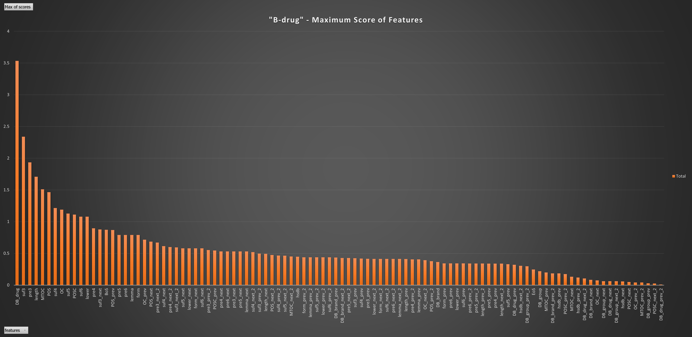

# Language Detection, Name-Entity Recognition and Classification, Drug-Drug Interaction Detection and Classification
Project of Mining Unstructed Data (MUD) Course for Master in Data Science Program of Universitat Politècnica de Catalunya (UPC)
***
The project is divided into 3 separate parts:

1. [Language Detection](./src/language_detection)
2. [Name Entity Recognition and Classification (NERC)](./src/NERC_traditional_ML) of pharmaceutical products and [Drug-Drug Interaction Detection and Classification (DDI)](./src/DDI_traditional_ML) with traditional Machine Learning (ML) techniques
3. [NERC](./src/NERC_DL) of pharmaceutical products and [DDI](./src/DDI_DL) with state-of-the-art Deep Learning (DL) techniques

Both solutions of part `2.` and `3.` make use of the `BIO tagging approach`. Also, part `2` and `3` consist of the same `training/dev/test` data and only the solution's implementation changes.

Below one can find information about the 3 parts of the project.

For getting access to the data of the project, contact me via email @`odykypar@gmail.com`

***
### Language Detection
In this part of the project an analysis of the performance of several preprocessing techniques and Machine Learning models for `Language Detection` task was accomplished. Word and character tokenization was tested and compared, as well as several different vocabulary sizes.

#### Preprocessing Steps
Preprocessing includes the usage of `NTLK` library, for `tokenization`, `lemmatization` and `POS tagging` of words or characters. Additionally, `PCA` was implemented for dimensionality reduction.

#### Classifiers Implemented
* Naive Bayes (NB)
* k-Nearest Neighbors (kNN)
* Decision Tree Classifier
* Support Vector Machine (SVM)

The source code used for this part of the project can be found [here](./src/language_detection)

***
### NERC and DDI with Traditional ML Techniques
In this part of the project, `NERC` and `DDI` tasks were performed by utilizing traditional ML approaches.

#### NERC with Traditional ML Techniques
In more detail, inside the given sentences that exist in the corpora, there are four types of entities that need to be recognized and subsequently classified, namely `drug`, `brand`, `group`, and `drug_n`. In order to recognize and classify the pharmaceutical entities of the available data that were extracted from biomedical texts, experiments were performed with two different classifiers: `Naive Bayes (NB)` and `Conditional Random Fields (CRF)`.

Before applying the classifiers, the most imprortant stage of this part of the project was the `generation of the features`. The features used are the following:

* Form of the token (`form=`)
* Lowercased form of the token (`lower=`)
* Length of the token (`length=`)
* A set of flags indicating whether the token matches certain words from four different lists (`DB_drug_list`, `DB_brand_list`, `DB_group_list`, and `hsdb_list`)
* Whether the token is at the beginning or end of a sentence (`BoS`, `EoS`)
* Suffixes of length 3, 4, 5, and 6 of the token (e.g. `suf3=`, `suf4=`, etc.)
* A set of flags indicating whether the token has special characters (`POSC`), such as punctuation or digits, or occurrences of one capital letter (`OC`) or more (`MTOC`).
* Prefixes of length 3, 4, 5, and 6 of the token (e.g. `pre3=`, `pre4=`, etc.)
* POS tag of the token, as determined by the NLTK library (`POS=`).
* Lemma of the token, as determined by the WordNet lemmatizer (`lemma=`).
* The same features as above for the previous one or two tokens, depending on the position of the current token in the sentence (e.g. `form_prev_1=`, `form_prev_2`, `form_next_1`, `form_next_2`, etc.).
  * In this case, checks were performed in order to validate if a token is at the start or at the end  of a sentence in order to avoid exceeding the sentence length or trying to select tokens with indexes like -1. All different cases are taken into account.

One important thing that needs to be clarified here is that the result of the `extract-features.py` script that is generating the features used for training the classifiers, is making use of the `B-I-O schema tagging`. `B-I-O schema tagging`, also known as the IOB (Inside-Outside-Beginning) tagging scheme, `is a commonly used method for NER`. In the B-I-O schema, each word in a text is tagged with a label that indicates whether it is part of an entity or not, and if so, which type of entity it belongs to.

Consequently, the `B-I-O tags` are being used by the classification algorithms to detect if a word in the sentence is an entity, and then to classify those entities into one of the following target labels: `B-drug`, `B-brand`, `B-group`, `B-drug_n`, `I-drug`, `I-brand`, `I-group`, `I-drug_n` and `O`.

Once all the above-mentioned features were calculated, `feature-importance` analysis was performed in order to conclude to the final set of features for training the classifiers. Graphs about feature importance per class of the analysis can be found in [feature-graphs folder](./feature-graphs). One example for the `B-drug` class is depicted in the figure below:



Finally, hyper-parameter tuning of the 2 mentioned classifiers took place.

The source code used for this part of the project can be found [here](./src/NERC_traditional_ML)

#### DDI with Traditional ML Techniques

With the `DDI Corpus`, which is a semantically annotated corpus of documents describing drug-drug interactions from the DrugBank[^1] database and MedLine[^2] abstracts, we face the goal of detecting when there is an interaction and when not, and classifying the existing drug-drug interactions into `advice`, `effect`, `mechanism`, and `int`.

In this case, the performed experiments made use of two ML algorithms, `Naive Bayes` and `Linear Support Vector Machine (Linear SVM)`.

The input to the `feature extractor` is not the sentence itself, but a `dependency tree` with added individual features about every node/word, generated with `CoreNLP`[^3]. CoreNLP (Core Natural Language Processing) is a popular open-source software library developed by Stanford University that provides a suite of natural language processing tools for a variety of tasks, including tokenization, part-of-speech (POS) tagging, named entity recognition, parsing, sentiment analysis, and coreference resolution.

The CoreNLP dependency tree object contained, for every word/node in a sentence, a dictionary with the following relevant information:

* Literal word 	
* Lemma of the word
* Part-of-speech (POS) tagging
* Address of head node
* Relations/dependencies with other nodes
* Offsets in the sentence

And then from there, with the help of the deptree.py module we could also obtain or infer:

* Least Common Subsumer (LCS) between words
* Paths in the dependency tree (labeled as we wanted)
* Head entity of a node
* Who is drug entity

It is important to mention here, that this part of the project is focused again in the `feature selection` process, for the task of DDI.

The `set of the initial features` was composed of:

* `lib`: lemma of the first token after e1 entity head
* `wib`: lemma of the first token after e2 entity head
* `lpig`: lemma and PoS tag of the first token after drug1 entity head
* `eib`: True/False. Presence of a third drug entity between e1 and e2.
* `path`: path with lemmas and relations from e1 head to LCS to e2 head
* `path1`: path up with lemmas and relations from e1 head to LCS
* `path2`: path down with lemmas and relations from LCS to e2 head 

Where the head token for each gold entity refers to the token in the dependency parse tree that corresponds to the main noun or verb that represents the entity. 

Additionally, a set of tests was performed to assess the effects of adding the rest of a particular token information (word, lemma, PoS tag, and combinations).

Also, features like `path1_nodes`, `path2_nodes`, `path1_edges`, `path1_nodes`, `path_edges` and `path_edges` were created which are based purely on words and PoS tags from the dependency relations. The addition of these features gave us a `3% increase on average in the macro F1` in the tests we performed. Two examples of these new features are:
```
 path2_nodes=inhibitor<inhibitor<NN<metabolism< metabolism<NN<theophylline<theophylline<NN
 path_edges=conj<<<indir<conj<<<indir
```
  
Finally, by analyzing the meaning behind the four different types of interactions to see if there was any pattern or possible indicators in the sentences that we could use in our favor to differentiate between them, rather than more analytical approaches as presented before. Here is the definition of every interaction type:

* `Advice`: DDI in which a recommendation or advice regarding the concomitant use of two drugs involved in them is described.
   * e.g.:  "Interactions may be expected, and UROXATRAL should NOT be used in combination with other alpha-blockers."
* `Effect`: DDI in which the effect of the drug-drug interaction is described.
   * e.g.: “Aspirin and Paracetamol help decrease temperature.”
* `Mechanism`: The mechanism of interaction can be pharmacodynamic (the effects of one drug are changed by the presence of another drug at its site of action, for example, "alcohol potentiates the depressor effect of barbiturates") pharmacokinetic (the processes by which drugs are absorbed, distributed, metabolized and excreted are affected, for example, ("induced the metabolism of", "increased the clearance of'). As already noted, a pharmacodynamic relationship between entities must be considered type effect.
   * e.g.: Grepafloxacin, like other quinolones, may inhibit the metabolism of caffeine and theobromine.
* `int`: the sentence simply states that an interaction occurs and does not provide any information about the interaction.
   * e.g.: The interaction of omeprazole and ketoconazole has been established.

The presence of certain `clue verbs before, between, and after` the `drug entities` could be useful information for labeling the different types of interactions.

The list of key terms for the `clue lemmas list` is the following:

```
 clue_lemmas = ["affect", "effect", "diminish", "produce", "increase", "result", "decrease", "induce", "enhance", "lower", "cause", "interact", "interaction", "shall", "caution", "advise", "reduce", "prolong", "not"]
```

The source code used for this part of the project can be found [here](./src/DDI_traditional_ML)

***
### NERC and DDI with Deep Learning

#### NERC with Deep Learning

#### DDI with Deep Learning

[^1]: [https://go.drugbank.com/](https://go.drugbank.com/)
[^2]: [https://www.nlm.nih.gov/medline/medline_overview.html](https://www.nlm.nih.gov/medline/medline_overview.html)
[^3]: [https://stanfordnlp.github.io/CoreNLP/](https://stanfordnlp.github.io/CoreNLP/)
